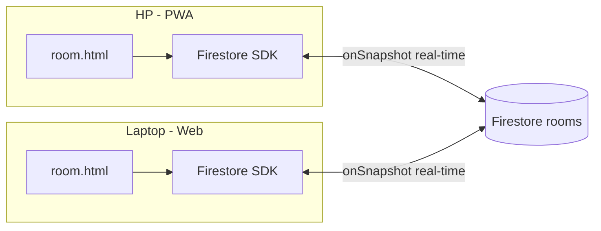
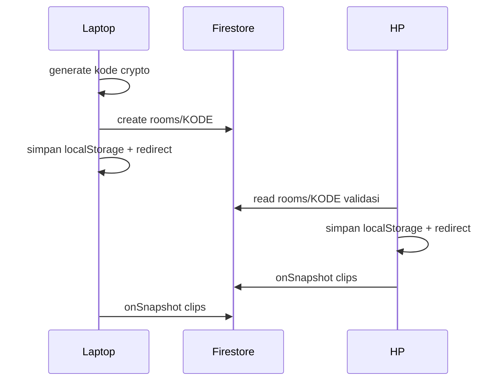
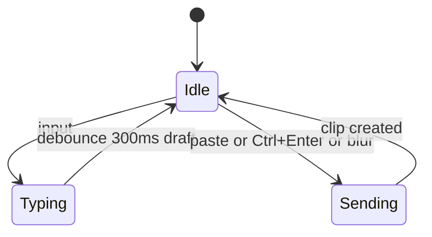

# Rencana Teknis — Catatan Bersama

Sinkron teks real-time dua arah antara HP dan laptop, tanpa login. Firebase Firestore + Hosting + PWA + Vanilla JS.

---

## 1. Struktur File

```
note online/
├── firebase.json              ← config Hosting + Firestore
├── .firebaserc                ← project ID (hasil firebase init)
├── firestore.rules            ← security rules (wajib)
├── firestore.indexes.json     ← composite index
├── public/
│   ├── index.html             ← landing (dari home.html)
│   ├── room.html              ← halaman room (dari catatan-bersama.html)
│   ├── 404.html               ← redirect ke /
│   ├── css/
│   │   └── style.css          ← design system shared (dari kedua prototype)
│   ├── js/
│   │   ├── firebase-init.js   ← init Firebase SDK
│   │   ├── utils.js           ← kode room, timeAgo, clipboard, device detect
│   │   ├── home.js            ← logika landing
│   │   └── room.js            ← logika halaman room
│   ├── vendor/
│   │   ├── firebase-app-compat.js        ← SDK self-host (offline PWA)
│   │   └── firebase-firestore-compat.js
│   ├── manifest.json          ← PWA manifest
│   ├── sw.js                  ← service worker
│   └── icons/
│       ├── icon-192.png
│       └── icon-512.png
└── plans/
    └── rencana-teknis.md      ← file ini
```

**Kenapa SDK self-host di `vendor/`:** biar PWA bisa offline (SW cache same-origin tanpa kompleksitas CORS cross-origin), dan gak dependensi runtime ke CDN Google.

---

## 2. firebase.json

```json
{
  "hosting": {
    "public": "public",
    "ignore": [
      "firebase.json",
      "**/.*",
      "**/node_modules/**"
    ],
    "rewrites": [
      {
        "source": "/room/**",
        "destination": "/room.html"
      }
    ],
    "headers": [
      {
        "source": "/sw.js",
        "headers": [
          { "key": "Cache-Control", "value": "no-cache" }
        ]
      },
      {
        "source": "**/*.@(html)",
        "headers": [
          { "key": "Cache-Control", "value": "no-cache" }
        ]
      }
    ]
  },
  "firestore": {
    "rules": "firestore.rules",
    "indexes": "firestore.indexes.json"
  }
}
```

Catatan:
- Rewrite `/room/**` → `room.html` biar URL `/room/XK92P4` langsung berfungsi (spec §9).
- HTML + `sw.js` no-cache biar update selalu terpropagate; aset statis (css/js/png) di-cache oleh service worker sendiri.
- `.firebaserc` hasil dari `firebase init` — project ID perlu dibuat di Firebase Console (atau lewat CLI).

---

## 3. Firestore Security Rules (firestore.rules)

```javascript
rules_version = '2';
service cloud.firestore {
  match /databases/{database}/documents {

    // Kode room valid: 6 karakter alfanumerik, tanpa dash
    function validRoom(roomId) {
      return roomId.matches('^[A-Za-z0-9]{6}$');
    }

    match /rooms/{roomId} {
      // Baca: siapa pun yang tahu kode valid
      allow read: if validRoom(roomId);

      // Create: field valid + createdAt recent (cegah backdating)
      allow create: if validRoom(roomId)
        && request.resource.data.createdAt is timestamp
        && request.resource.data.lastActive is timestamp
        && request.resource.data.createdAt >= request.time - duration(5, 'minutes')
        && request.resource.data.createdAt <= request.time + duration(5, 'minutes');

      // Update: hanya lastActive (heartbeat)
      allow update: if validRoom(roomId)
        && request.resource.data.diff().affectedKeys().hasOnly(['lastActive']);

      // Room gak bisa dihapus dari klien
      allow delete: if false;

      match /clips/{clipId} {
        allow read: if validRoom(roomId);

        // Create: validasi penuh data clip
        allow create: if validRoom(roomId)
          && request.resource.data.text is string
          && request.resource.data.text.size() > 0
          && request.resource.data.text.size() <= 10000
          && request.resource.data.device is string
          && request.resource.data.device.size() <= 30
          && request.resource.data.pinned is bool
          && request.resource.data.createdAt is timestamp
          && request.resource.data.createdAt >= request.time - duration(5, 'minutes')
          && request.resource.data.createdAt <= request.time + duration(5, 'minutes');

        // Update: hanya toggle pin (teks gak bisa diubah post-hoc)
        allow update: if validRoom(roomId)
          && request.resource.data.diff().affectedKeys().hasOnly(['pinned']);

        // Delete: fitur Hapus + auto-expire
        allow delete: if validRoom(roomId);
      }
    }
  }
}
```

**Kenapa rules ini cukup:**
- Kode 6 karakter alfanumerik = 62⁶ ≈ 56 miliar kombinasi — tanpa auth, kode adalah kunci akses (spec §8).
- Batasi ukuran teks (10.000 karakter) + recency check `createdAt` cegah spam write / backdating.
- Update hanya `pinned` — teks yang sudah dikirim gak bisa diubah, riwayat tetap integri.
- Rate-limit per-IP tidak bisa di rules tanpa auth; mitigasi praktis = batasi ukuran + recency. (Opsional nanti: Cloud Function.)

---

## 4. firestore.indexes.json

```json
{
  "indexes": [
    {
      "collectionGroup": "rooms",
      "queryScope": "COLLECTION_GROUP",
      "fields": [
        { "fieldPath": "pinned", "order": "ASCENDING" },
        { "fieldPath": "createdAt", "order": "DESCENDING" }
      ]
    }
  ],
  "fieldOverrides": []
}
```

Index ini dibutuhkan untuk query auto-expire: `where("pinned", "==", false).orderBy("createdAt", "desc")`. Query riwayat utama (`orderBy("createdAt", "desc")` + limit 50) cuma field tunggal — Firestore auto-index, gak perlu di-declare.

---

## 5. Model Data

```
rooms/{roomId}                    // roomId = 6 karakter, e.g. "XK92P4"
  ├── createdAt: timestamp
  ├── lastActive: timestamp
  └── clips/{clipId}              // clipId = auto ID Firestore
        ├── text: string          // 1..10000 karakter
        ├── createdAt: timestamp
        ├── device: string        // "HP" | "laptop" | nama custom (<=30)
        └── pinned: boolean
```

---

## 6. PWA

### manifest.json

```json
{
  "name": "Catatan Bersama",
  "short_name": "Catatan",
  "description": "Satu buku catatan, dua tangan menulisnya — sinkron teks real-time antara HP dan laptop.",
  "start_url": "/",
  "scope": "/",
  "display": "standalone",
  "background_color": "#F4EFE1",
  "theme_color": "#7A2430",
  "lang": "id",
  "icons": [
    { "src": "/icons/icon-192.png", "sizes": "192x192", "type": "image/png", "purpose": "any" },
    { "src": "/icons/icon-512.png", "sizes": "512x512", "type": "image/png", "purpose": "any" }
  ]
}
```

### sw.js (skeleton)

```javascript
const VERSION = 'v1';
const CACHE = `catatan-${VERSION}`;
const PRECACHE = ['/', '/room.html', '/css/style.css', '/manifest.json'];

self.addEventListener('install', (e) => {
  e.waitUntil(caches.open(CACHE).then((c) => Promise.all(
    PRECACHE.map((u) => c.add(new Request(u)))
  )).then(() => self.skipWaiting()));
});

self.addEventListener('activate', (e) => {
  e.waitUntil(caches.keys().then((keys) => Promise.all(
    keys.filter((k) => k !== CACHE).map((k) => caches.delete(k))
  )).then(() => self.clients.claim()));
});

self.addEventListener('fetch', (e) => {
  const url = new URL(e.request.url);
  if (e.request.method !== 'GET') return;

  // Navigasi HTML: network-first, fallback cache (offline tetap bisa buka)
  if (e.request.mode === 'navigate') {
    e.respondWith(fetch(e.request).then((res) => {
      const copy = res.clone();
      caches.open(CACHE).then((c) => c.put(e.request, copy));
      return res;
    }).catch(() => caches.open(CACHE).then((c) => c.match(e.request))));
    return;
  }

  // Aset statis same-origin: cache-first
  if (url.origin === self.location.origin) {
    e.respondWith(caches.open(CACHE).then((c) => c.match(e.request)).then((res) => {
      if (res) return res;
      return fetch(e.request).then((res) => {
        const copy = res.clone();
        caches.open(CACHE).then((c) => c.put(e.request, copy));
        return res;
      });
    }));
  }
});
```

Catatan: bump `VERSION` saat deploy update biar cache lama ke-invalidate.

---

## 7. Detail Implementasi

### 7.1 Kode room (js/utils.js)

- **Generate** (create): `crypto.getRandomValues` — 6 karakter dari `ABCDEFGHJKLMNPQRSTUVWXYZ23456789` (exclude `I,O,0,1`).
- **Simpan**: 6 karakter tanpa dash → `XK92P4` (Firestore doc ID).
- **Tampilkan**: insert dash posisi 3 → `XK9-2P4`.
- **Normalize input** (join): uppercase → strip non-alfanumerik → validasi 6 karakter.

### 7.2 Landing (index.html + js/home.js)

1. **Buat ruang baru** → generate kode → `setDoc(rooms/{kode}, {createdAt, lastActive})` → simpan kode di `localStorage.roomId` → redirect `/room/{kode}`.
2. **Gabung ruang** → normalize input → `getDoc(rooms/{kode})` validasi exists → simpan localStorage → redirect.
3. Kalau `localStorage.roomId` sudah ada → landing tampilkan link "Masuk ke ruang yang sudah ada" (UX plus, opsional).

### 7.3 Halaman room (room.html + js/room.js)

**Routing:**
1. `roomId` = dari URL path (`/room/XK92P4`) atau `localStorage.roomId`.
2. Gak ada dua-dua → redirect `/`.
3. URL ada tapi localStorage kosong → simpan localStorage.
4. localStorage ada tapi URL kosong → redirect ke `/room/{roomId}` (URL canonical).

**Composer (per diskusi desain):**
- Event `paste` → auto-send (1 dokumen per paste).
- Ketik → draft di localStorage (debounce 300ms), commit jadi catatan saat: tombol **Kirim**, **Ctrl+Enter**, atau blur dengan teks non-kosong.
- Char counter update live.
- Device picker: persist di localStorage, default auto-detect (UA mobile → `HP`, else `laptop`).

**Riwayat real-time:**
```javascript
const q = query(
  collection(db, 'rooms', roomId, 'clips'),
  orderBy('createdAt', 'desc'),
  limit(50)
);
onSnapshot(q, (snap) => { /* render + status syncing */ });
```
- Load more: `startAfter(lastDoc)` + `limit(50)`.
- Render pakai `textContent` (XSS-safe, dari prototype).
- Action berbasis **doc ID** (`data-id`), bukan index — aman saat sync dua arah.
- Copy: `navigator.clipboard.writeText` + fallback `execCommand('copy')`.
- Hapus: `deleteDoc`.
- Waktu: helper `timeAgo()` dari `createdAt` timestamp, refresh tiap menit.

**Status indikator:**
- `navigator.onLine` + event `online`/`offline` → dot moss (online) / wine-soft (offline).
- `snapshot.metadata.hasPendingWrites` → label "Sinkron…".
- Default: "Tersambung". Tambah `role="status"` + `aria-live="polite"`.

**Ganti Room:** tombol di masthead → hapus `localStorage.roomId` → redirect `/`.

### 7.4 Auto-expire (v1.5, murah untuk ditambah)

Saat room dibuka: query `where("pinned", "==", false).where("createdAt", "<", cutoff7hari)` → `deleteDoc` per hasil. Client-side, gratis, gak butuh Cloud Function.

---

## 8. Diagram

### Arsitektur data flow



### Alur pairing



### State composer



---

## 9. Checklist Implementasi

1. Setup Firebase project: `firebase login` + `firebase init` (Hosting + Firestore), lalu deploy `firestore.rules` + `firestore.indexes.json`
2. Ekstrak design system → `public/css/style.css` (merge dari kedua prototype)
3. `public/js/utils.js` — kode room (crypto gen, normalize, format), `timeAgo`, clipboard fallback, device detect
4. `public/js/firebase-init.js` + download SDK compat ke `public/vendor/`
5. `public/index.html` + `public/js/home.js` — landing: buat/gabung room, localStorage
6. `public/room.html` + `public/js/room.js` — composer, riwayat real-time, status, ganti room
7. PWA: `manifest.json`, `sw.js`, icons (192 + 512)
8. Deploy + test pairing HP ↔ laptop (2 device real)